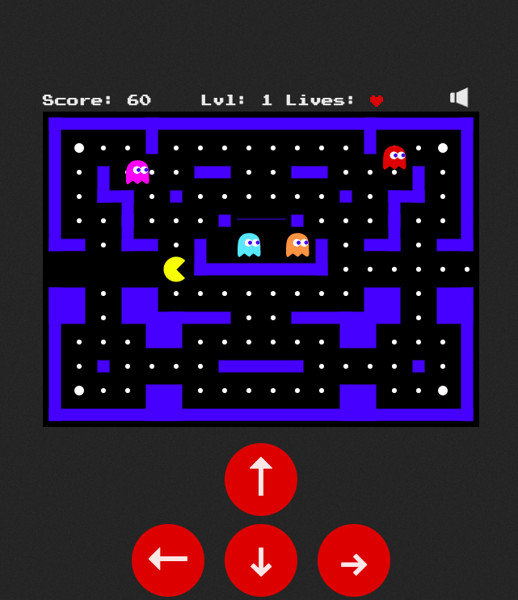

[](https://github.com/kota661/pacman/actions/workflows/main.yaml)


# Pacman!




みんな大好きPacmanのWebアプリ

元ネタ：https://github.com/platzhersh/pacman-canvas


バージョンは２バージョン

* v1：Pacmanの機能が一通り遊べます。ライフが１つだけ
* v2：v1では遊び足りないという方向けに、ライフが**３つ**に増えてより長く遊べるバージョンです


## Run the app locally - node

```shell
cd pacman
npm install
npm start
```


## Run the app locally - docker

```
docker build -t pacman .
docker run -d -p 80:8080 pacman

# ブラウザで http://localhost にアクセス
```


## IBM Cloud Foundry

```
ibmcloud cf push pacman .
```


## IBM Cloud Kubernetes Service

```
kubectl run pacman --image=kota661/pacman:v1 --port=8080
kubectl expose deployment pacman --port 8080 --type NodePort

# NodePort Access
WORKER_NODE_PUBLIC_IP=$(kubectl get node -o=jsonpath='{.items[0].status.addresses[?(@.type=="ExternalIP")].address}')
NODE_PORT=$(kubectl get svc pacman -o=jsonpath='{.spec.ports[0].nodePort}')
echo http://$WORKER_NODE_PUBLIC_IP:$NODE_PORT

# version up
kubectl set image deploy/pacman pacman=kota661/pacman:v2
echo http://$WORKER_NODE_PUBLIC_IP:$NODE_PORT

# cleanup
kubectl delete all -l app=pacman
```


## RedHat OpenShift

```
# プロジェクトの作成
oc new-project pacman

# アプリの作成（Githubを使ってアプリを作成）
oc new-app --name pacman https://github.com/kota661/pacman.git

# デプロイ結果の確認
oc get pods,svc -n pacman

# アプリの公開
oc create route edge --service=pacman -n pacman
oc get route -n pacman

# お掃除
oc delete all -l app=pacman -n pacman
```

